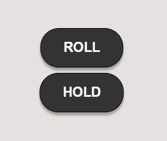
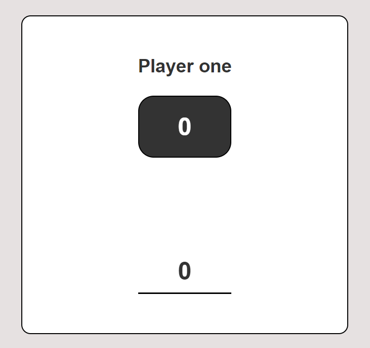
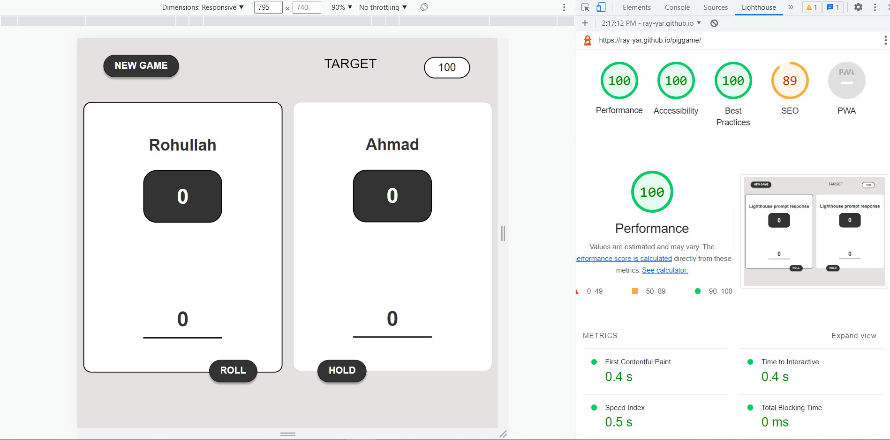

## PigGame
---

This is a exciting game, In this game we have 2 players and each of them has to roll the dice. each time that they roll the dice the number is added to the current score and if you want you can click he hold button to hold the scores if not you can go on untill the dice rolls to 1, at that moment all the scores you have achieved through that turn will set to zero and the next player must roll the dice and the first player who achieves 100 points will be the winner.

<a href="https://ray-yar.github.io/piggame/" target="_blank">Visit the live project here</a>

## Features
---

This game contains very friendly interface for a players to pass their time. Great coloring and great layout design cause it should be more and more specific and beautifull.

## Existing Features

- The Target Point

    - This part show the total score that players need to get. It is very good to be exist for the case of new users who don't know how much the should get to win the game.

        

- Dice Roll

    - This part is will show the random number between 1 to 6 and according to this number it will increate the users current number.

        

- Core Buttons

    - This buttons are used to configure web settings. i.e "New Button" can renew the game and "Roll Dice" button can call for new dice roll. "Hold" button can save the current number which was played by player.

        

- Current Number

    - This part shows the current score which is being collect by players. It is a dynamic score show, that increase itself be rolling dice. And if dice is get "1" number the current number will be "0".

        

- Player One

    - This part shows the whole informations about player one. When the turn get on the player one the background will be white. 
    
    - Player name is also dynamic, because it gets the user name from a prompt and then it will set the name. If the name section was null the default name will be set to "Player One".

        

- Player Two

    - This part shows the whole informations about player two.

        

## Testing

---

**Chrome lighthouse**, I have tested Preformance, Accessibility, Best Practivces, SEO and PWA in chrom lighthouse. And every thing was very smooth and the preformance was excellent.

## Validator Testing
- HTML
    - No errors were returned when passing through the official <a href="https://validator.w3.org/">W3C</a> validator

        
        
- CSS
    - No errors were found when passing through the official <a href="https://jigsaw.w3.org/css-validator/">Jigsaw</a> validator

        
        
- JavaScript
    - No errors were found when passing through the official <a href="https://jshint.com/">Jshint</a> validator

        

## Unfixed Bugs
- There was multi warnings related to javascript that was not able to be remove. So, I have added `/*jshint esversion: 6 */` code in the first line of JS to remove warnings.

## Deployment
This project was developed using <a href="https://gitpod.io/workspaces" target="_blank">GitPod</a>, committed to git and pushed to GitHub using git commands.

To deploy this page to GitHub Pages from its GitHub repository, the following steps were taken:

* Log into <a href="https://github.com/" target="_blank">GitHub</a>.
* From the list of repositories on the screen, select **Ray-yar/piggame**.
* From the menu items near the top of the page, select **Settings**.
* Scroll down to the GitHub Pages section.
* Under Source click the drop-down menu labelled **None** and select **Master Branch**. Then Save it.
* Wait for a few minutes of the website to be deployed.
* Scroll back down to the GitHub Pages section to access the link to the deployed website.

The live link can be found here - <a href="https://ray-yar.github.io/piggame/" target="_blank">https://ray-yar.github.io/piggame/</a>

## Credits
-------------
## Content

All the texts in this game was added by developer according the game concept. 

## Media
* The photos used as the dice were taken from open source site

## Acknowledgements

---

I decided to develop this game as a real-life game, those who needs to pass their time for some fans this should be their first choice.

 I have seen gitHub repositories, basic concept of making this game was from their and some other use able concepts that make the game more powerfull was by myself.

 * Huge thanks to my mentor <a href="https://github.com/guidocecilio" target="_blank"> Guido Cecilio Garcia Bernal</a> guided me throughout this project. 